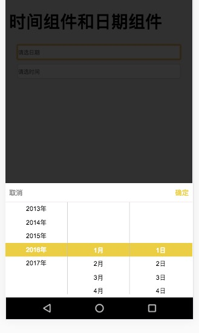

# 手机端裁剪

    vue组件，手机端裁剪
    
    ```
    .
    |-- build
    |-- src
        |-- components
            |-- crop 裁剪组件, 上下左右移动，放大缩小图片
            |-- datePicker 手机端日期选择组件年、月、日
            |-- timePicker 手机端时间选择组件时、分
            |-- calendarSchedule 手机端横版日历，包括有农历、星期
        |-- views
             |-- cropDemo //裁剪demo
             |-- date&timePicker //时间和日期demo
             |-- calendarSchedule //农历日历，带星期几，横版 demo
    .
    ```
    
    
### crop


### datePicker


### timePicker


### calendarSchedule


